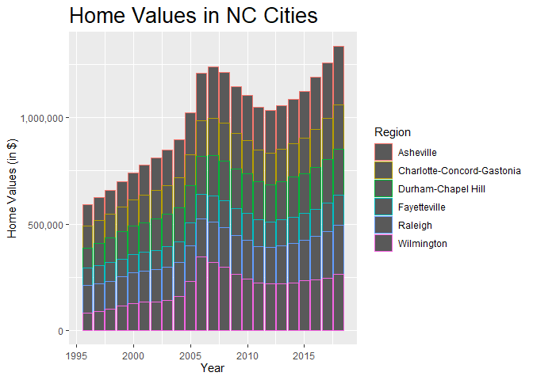
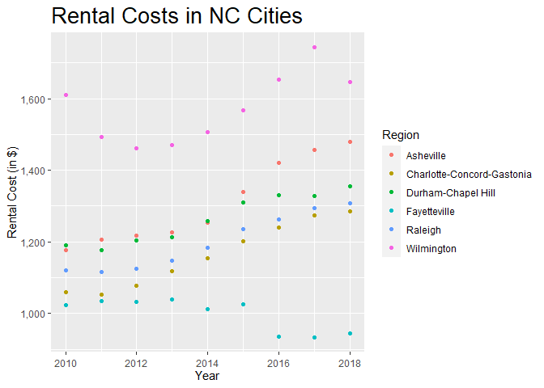
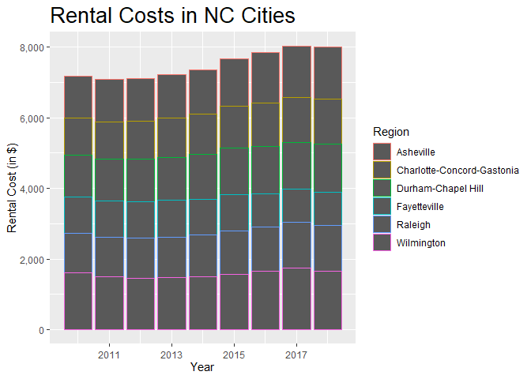
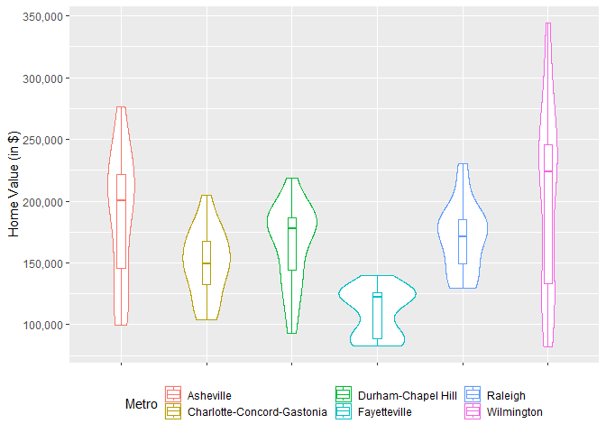
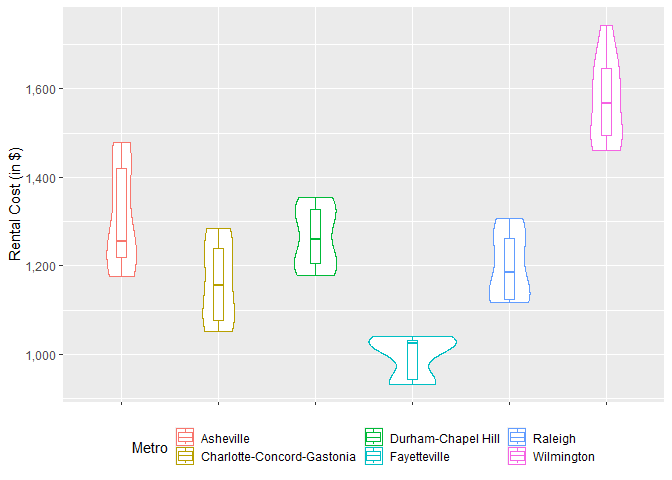

# Zillow Home Value Index Analysis NC

# Zillow Home Value Index Analysis

Our aim is observe and describe trends in the Zillow Home Value Index
for North Carolina. We will do so using R via R Studio. First, we import
the data and read our required packages.

``` r
library(tidyverse)
```

    ── Attaching core tidyverse packages ──────────────────────── tidyverse 2.0.0 ──
    ✔ dplyr     1.1.2     ✔ readr     2.1.4
    ✔ forcats   1.0.0     ✔ stringr   1.5.0
    ✔ ggplot2   3.4.2     ✔ tibble    3.2.1
    ✔ lubridate 1.9.2     ✔ tidyr     1.3.0
    ✔ purrr     1.0.1     
    ── Conflicts ────────────────────────────────────────── tidyverse_conflicts() ──
    ✖ dplyr::filter() masks stats::filter()
    ✖ dplyr::lag()    masks stats::lag()
    ℹ Use the conflicted package (<http://conflicted.r-lib.org/>) to force all conflicts to become errors

``` r
library(dplyr)
SingleFamilyResidenceRental = read_csv("SingleFamilyResidenceRental.csv")
```

    Rows: 13273 Columns: 102
    ── Column specification ────────────────────────────────────────────────────────
    Delimiter: ","
    chr  (4): RegionName, State, Metro, CountyName
    dbl (98): RegionID, SizeRank, 2010-11, 2010-12, 2011-01, 2011-02, 2011-03, 2...

    ℹ Use `spec()` to retrieve the full column specification for this data.
    ℹ Specify the column types or set `show_col_types = FALSE` to quiet this message.

``` r
SingleFamilyResidenceSales = read_csv("SingleFamilyResidenceSales.csv")
```

    Rows: 12797 Columns: 277
    ── Column specification ────────────────────────────────────────────────────────
    Delimiter: ","
    chr   (4): RegionName, State, Metro, CountyName
    dbl (273): RegionID, SizeRank, 1996-04, 1996-05, 1996-06, 1996-07, 1996-08, ...

    ℹ Use `spec()` to retrieve the full column specification for this data.
    ℹ Specify the column types or set `show_col_types = FALSE` to quiet this message.

I have lived all over the state of North Carolina. We have six main
cities - Asheville, Charlote, Durham, Fayetteville, Raleigh, and
Wilmington. I have lived in three of these (Charlotte, Durham, and
Raleigh) and within 2 hours of the other three (Asheville, Fayettevile,
Wilmington). Each NC city is unique and wildly different than the
others. With this dataset, I had two options: to isolate homes just in
the cities themselves, or instead go by metro area and include the outer
rings around the cities. As an NC resident, I know that much of the city
is characterized by its surrounding suburbs, so I decided to take the
metro area approach.

## Home Sale Value Trends in NC Cities, 1996-2018

Let’s start by looking at the home sale value trends in the years
provided by our dataset, 1996–2018, for these aforementioned metro
areas. I first narrow down our original dataset to isolate NC to our
specified metro areas. I also remove columns we will not be using.

``` r
Sales = SingleFamilyResidenceSales %>% filter(State=="NC",Metro%in%c("Asheville","Charlotte-Concord-Gastonia","Durham-Chapel Hill","Fayetteville","Raleigh","Wilmington"))
Sales = Sales %>% select(-RegionID,-SizeRank,-RegionName,-CountyName,-State)
```

We’re left with a pretty large and wide data frame. To simplify, I will
find the average for each year. First, the pivot_longer function will
convert our YYYY-MM columns into rows. It creates two new columns,
YearMonth, and Value, thus elongating our dataset and reducing the
number of columns. Then, the ‘mutate’ function to separate out the year
and month from our YYYY-MM column into month and year columns. Then
‘group_by’ and ‘summarize’ is used to find the average of property value
for each unique combination of our grouping variables. Then I rename our
calculate average to AveragePrice for clarity.

``` r
Sales_averaged=
  Sales %>%
  pivot_longer(
    cols=-c(Metro),
    names_to="YearMonth",
    values_to="Value"
  ) %>%
  mutate(
    Year=as.integer(substr(YearMonth, 1, 4)),
    Month=as.integer(substr(YearMonth, 6, 7))
  ) %>%
  group_by(Metro,Year) %>%
  summarize(Average = mean(Value, na.rm = TRUE)) %>%
  rename(AverageZHVI=Average)
```

    `summarise()` has grouped output by 'Metro'. You can override using the
    `.groups` argument.

Now let’s visualize our home values in Wake County, NC using ggplot. We
also use ggsave to save our plots as image files.

``` r
Sales_point=
  ggplot(Sales_averaged,aes(Year,AverageZHVI,color=Metro))+
  geom_point()+
  labs(x="Year",y="Home Values (in $)",title="Home Values in NC Cities")+
    theme(axis.text.x = element_text(vjust=0.5),
          plot.title=element_text(size=20))+
    scale_y_continuous(name="Home Values (in $)", labels=scales::comma)+
  scale_color_discrete(name="Region")
  
Sales_col=
  ggplot(Sales_averaged,aes(Year,AverageZHVI,color=Metro))+
  geom_col()+
  labs(x="Year",y="Home Values (in $)",title="Home Values in NC Cities")+
    theme(axis.text.x = element_text(vjust=0.5),
          plot.title=element_text(size=20))+
    scale_y_continuous(name="Home Values (in $)", labels=scales::comma)+
  scale_color_discrete(name="Region")

Sales_point
```


``` r
Sales_col
```



``` r
ggsave("Sales_point.png", Sales_point)
```

    Saving 7 x 5 in image

``` r
ggsave("Sales_col.png", Sales_col)
```

    Saving 7 x 5 in image

Here we have some notable trends. Wilmington and Asheville have much
higher home values than its counterparts. This trend is evident starting
from 2005 onward. Prior to that, we see Asheville and Wilmington with
lower home values than Raleigh, Durham-Chapel Hill, and in some earlier
years Charlotte-Concord-Gastonia. Wilmington has an extremely dramatic
peak in 2006. All home values dipped in 2012. Fayetteville, which had
similar values to Wilmington in 1996, has not fared as well as the other
metropolitan areas and has dramatically lower values overall compared to
the other metropolitan areas. If North Carolinians were lucky enough to
own property in the Asheville or Wilmington areas, or inherit family
properties, they would have seen a dramatic and lucrative increase in
home value 1996 to 2018. Similarly, investors may want to continue
investing in Asheville and Wilmington as home values continue to climb.
Charlotte-Concord-Gastonia, Durham-Chapel Hill, and Raleigh similarly
show strong and relatively consistent upward trend of home values.
Conversely, investors may want to stay away from Fayetteville, which has
remained mostly stagnant where its counterparts have exceeded.

### Rental Values in NC Cities, 2010-2018

I have rented extensively in the state of North Carolina, from the
mountains to the coast. Let’s explore rental price trends across our
metropolitan areas. For our rental dataset, data is only available
2010–2018.

``` r
Rentals=SingleFamilyResidenceRental%>%
  filter(Metro%in%c("Asheville","Charlotte-Concord-Gastonia","Durham-Chapel Hill","Fayetteville","Raleigh","Wilmington"),State=="NC")
Rentals=Rentals%>%
  select(-RegionID,-SizeRank, -RegionName, -State, -CountyName)
```

With the same code as before, we will arrange our tibble so that we have
an average for each year and region.

``` r
Rentals_averaged=
  Rentals %>%
  pivot_longer(
    cols=-c(Metro),
    names_to="YearMonth",
    values_to="Value"
  ) %>%
  mutate(
    Year=as.integer(substr(YearMonth, 1, 4)),
    Month=as.integer(substr(YearMonth, 6, 7))
  ) %>%
  group_by(Metro,Year) %>%
  summarize(Average = mean(Value, na.rm = TRUE)) %>%
  rename(AverageZHVI=Average)
```

    `summarise()` has grouped output by 'Metro'. You can override using the
    `.groups` argument.

Now let’s visualize our rental prices.

``` r
Rentals_point=
  ggplot(Rentals_averaged,aes(Year,AverageZHVI,color=Metro))+
  geom_point()+
  labs(x="Year",y="Average Rental Cost (in $)",title="Rental Costs in NC Cities")+
    theme(axis.text.x=element_text(vjust=0.5),
          plot.title=element_text(size=20))+
    scale_y_continuous(name="Rental Cost (in $)", labels = scales::comma)+
  scale_color_discrete(name="Region")

Rentals_col=
  ggplot(Rentals_averaged,aes(Year,AverageZHVI,color=Metro))+
  geom_col()+
  labs(x="Year",y="Average Rental Cost",title="Rental Costs in NC Cities")+
    theme(axis.text.x=element_text(vjust=0.5),
          plot.title=element_text(size=20))+
    scale_y_continuous(name="Rental Cost (in $)", labels = scales::comma)+
  scale_color_discrete(name="Region")

Rentals_point
```



``` r
Rentals_col
```



``` r
ggsave("Rentals_point.png",Rentals_point)
```

    Saving 7 x 5 in image

``` r
ggsave("Rentals_col.png",Rentals_col)
```

    Saving 7 x 5 in image

Similar to our sales values, the rental values in the state of NC are in
an upward trend. Asheville and Wilmington also have greater rental
values, similar to home sale value. We see a dip in rental values
2011–2012 which coincides with the dip in home sale values in 2012. We
see an overall strong upward trend of all the metropolitan areas rental
values, except for Fayetteville. Even though we did see Fayetteville
with a positive upward trend in home sale value, from 2013 to 2018,
rental value has actually fallen. For investors, I would avoid
Fayetteville while continuing investment in Asheville. For renters,
Fayetteville is the most affordable of the NC metro areas. The NC
vacation destinations Asheville and Wilmington are the most expensive,
although this may be skewed by short-term rental data. However, it does
appear that rental prices were plateauing off for all metropolitan areas
in 2018, so prior to investment in a property for rental purposes, it
may be wise to forecast future home trends to guide investment
decisions. For renters, this could be a welcome plateau for a cooling
off of rental trends.

## Home Sale Values 1996–2018 and Rental Values 2010–2018 in NC Cities, Compared

To get a closer look at the data behind the trends, let’s create a
violin boxplot. A violin boxplot gives us information on distribution of
our data and draw conclusions about the skewness of groups. The boxplot
inside of our violin provides visualization of our key statistical
measures, such as median, interquartile range, and the presence of
outliers.

**Home Sale Values Violin Boxplot**

``` r
Sales_violinbox=
  ggplot(Sales_averaged,aes(Metro,AverageZHVI,color=Metro))+
  geom_violin()+geom_boxplot(width=0.1)+
  labs(x="Region",y="Home Value (in $)")+
  theme(axis.text.x.bottom = element_blank(), 
        axis.title.x = element_blank(),
        legend.key.size=unit(.5,"cm"),
        legend.position="bottom",
        legend.direction="horizontal")+ 
  scale_y_continuous(labels = scales::comma)

Sales_violinbox
```



``` r
ggsave("Sales_violinbox.png",Sales_violinbox)
```

    Saving 7 x 5 in image

Our violin boxplot elucidates our previously observed home sales trends.
We can see our vacation home markets-Asheville and Wilmington-have the
greatest distributions around the third quartile. Both medians are
positively skewed as well. Both Asheville and Wilmington’s boxplots are
also much longer than our other metropolitan areas, indicating they have
a greater range of home values versus other areas. Additionally, this
indicates the presence of outliers both in higher and lower home values.

Meanwhile, we see that Fayetteville has a very high density of homes
around the third quartile as well as its bottom whisker. The median is
also heavily skewed toward the third quartile. 

Charlotte-Concord-Gastonia, Durham-Chapel Hill, and Raleigh have more
normally distributed violin boxplots. We see data more heavily
distributed around medians more equally located between our first and
third quartiles. Durham-Chapel Hill does have a more positive skew with
increased density toward the third quartile compared to the others, and
a long bottom whisker likely skewed by negative outliers. Raleigh’s
upper whisker is longer, indicating skew by positive outliers.
Charlotte-Concord-Gastonia also has a slightly longer upper whisker.

For home buyers, this information means a few things:

1.  Our vacation home areas, Asheville and Wilmington, have both homes
    of very high home sale value as well as very low. Most homes will be
    of higher home sale value. However, the market also will consist of
    homes on the much lower end of the home sale value range. These
    homes are likely in the areas surrounding the cities.

2.  Fayetteville, while with a much lower home value overall compared to
    the other cities, has most homes available in its higher ranges. It
    will also have homes on the lower end of its range, likely also
    outside of the city proper.

3.  Charlotte-Concord-Gastonia, Durham-Chapel Hill, and Raleigh will
    have more homes available around their medians. The metro areas’
    respective suburbs will be similar in price to the proper cities,
    indicated by less skew and more normal boxplot distributions. There
    will be some representation of very high-priced homes, likely in
    high-demand areas or directly in the cities themselves.

**Rental Values Violin Boxplot**

``` r
Rentals_violinbox=
  ggplot(Rentals_averaged,aes(Metro,AverageZHVI,color=Metro))+
  geom_violin()+geom_boxplot(width=0.1)+
  labs(x="Region",y="Rental Cost (in $)")+
  theme(axis.text.x.bottom = element_blank(), 
        axis.title.x = element_blank(),
        legend.key.size=unit(.5,"cm"),
        legend.position="bottom",
        legend.direction="horizontal")+ 
  scale_y_continuous(labels = scales::comma)

Rentals_violinbox
```



``` r
ggsave("Rentals_violinbox.png",Rentals_violinbox)
```

    Saving 7 x 5 in image

Now let’s take a look at our rental violin boxplot. At first glance, our
violins look much different than our sales’ — whereas our sales were
more centrally distributed, for rentals, it appears distributed more so
toward upper and lower ranges.

Asheville has a long range with median very close to the first quartile.
Our distribution is heavier toward the third quartile followed by the
first quartile/upper whisker.

Wilmington, with a much higher overall rental cost, has a much long
upper whisker than lower whisker, with distribution more evenly
distributed around first and third quarters and the median. It has a
notably longer upper whisker than lower whisker.

Charlotte-Concord-Gastonia, Durham-Chapel Hill, and Raleigh have more
normally distributed violins. We see near symmetrical distributions
around the first and third quartiles. Raleigh and
Charlotte-Concord-Gastonia both have longer upper whiskers than lower,
but with negatively skewed median values.

Fayetteville has a very heavy distribution around the third quartile.
The median is also very close to the third quartile.

For home renters, this means a few things:

1.  Wilmington is the most expensive area for rent in NC, followed by
    Asheville. These are two of our prime vacation destinations and this
    is likely inflated by short-term rental property pricing.

2.  Asheville has most home rental values around its median; however, a
    significant share of the market is also higher-value rentals.

3.  Wilmington has a higher rental value market overall, with an even
    distribution of availability across its first and third quartiles.
    There will also be some representation of very high value rental
    homes.

4.  Charlotte-Concord-Gastonia, Durham-Chapel Hill, and Raleigh have
    more homes available around their medians. Raleigh and
    Charlotte-Concord-Gastonia will have some home sale values much
    higher than the median, likely in very high-demand areas directly in
    the citty proper.

5.  Fayetteville has lowest overall rental values for all the NC metro
    areas. However, of its rentals, most will be found in the higher end
    of its ranges. There will be a few lower-value rental options but,
    like our other metro areas, this will likely in the surrounding
    Fayetteville metro area rather than in Fayetteville itself.

## Conclusions

The NC home sale value and rental value market has a positive upward
trend overall. Fayetteville is the exception, where we see only modest
increases in home sale value and an overall decrease in rental values.
For renters, Fayetteville is the most affordable metropolitan option in
the state. For investors, it may be wise to avoid the Fayetteville area.

Conversely, the NC vacation areas of Asheville and Wilmington are
booming. Home values have seen dramatic increases 1996–2018. The
majority of home sale values for these metro areas are in the higher end
of their respective home value ranges. Likewise, we see much higher
rental prices with more homes available in the higher ends of the rental
ranges. Conversely, there are many relatively lower cost home sale
values and lower cost rent options in these metropolitan areas, but
these are likely outside of the cities. Investors may want to
investigate the areas surrounding Asheville and Wilmington as people
push outwards from their city centers in search of lower home and rental
prices. Asheville and Wilmington have higher home sale values and higher
rents. However, this data may be skewed by vacation home and short-term
rental pricings.

Our main residential metro areas, Charlotte-Concord-Gastonia,
Durham-Chapel Hill, and Raleigh, have also seen significant increases in
home sale and rental values. In 2018, however, it appears there may be a
cooling in the magnitude of this upward trend for rental values.
Conversely, in 2018, home price values show no signs of slowing down.
For investors, it may be more lucrative for investment in home sale
opportunities versus in home rentals. For renters, this may open
opportunities for people to afford rent in these areas. In terms of home
sale values, all three of these areas have home sale values more around
their median prices. There is some higher-end home sale values in
Raleigh and Charlotte-Concord-Gastonia, likely in the high-demand areas
directly in the city. All three areas will have home sale values in its
surrounding areas similar to those in the cities.

Overall, our NC metro areas show significant growth in values. There is
a huge amount of investment potential for investors and homeowners,
particularly our vacation destinations. Renters in our main residential
metropolitan areas will see similar median pricing in the surrounding
suburbs, with higher pricing directly in the city centers.
